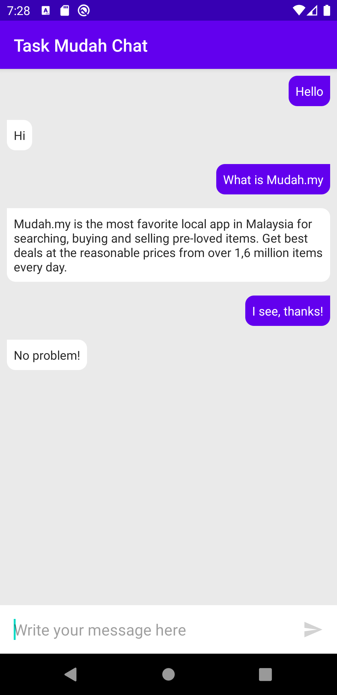

# TaskMudahChat
Coding challenge: Develop a simple Android/iOS app (with Java, Kotlin or Swift) that features a chat screen with preloaded data.

## Android Studio
1. Developed on version 4.0.1
2. Code tested on emulator (Pixel 3A API 29)
3. Clone the project and open with Android Studio
4. Run gradle
5. Run the project

## Libraries
1. Architecture
    1. MVVM
    2. Room
    3. Data Binding
    4. ViewModel
    5. Coroutine
    
2. DI
    1. Hilt
    
3. API
    1. Retrofit
    
4. Test
    1. Mockk

## Features
1. Display preload chats from db
2. Send message
3. Sent message store to local when success
4. Error message when network error or message null

## Missing features
1. Display a message if user did not type anything for a minute
2. Use RxJava instead of Coroutine
3. Defined proper error message (like network error message)

## Reference
[architecture-samples](https://github.com/android/architecture-samples)
[architecture-rick-and-morty](https://itnext.io/android-architecture-hilt-mvvm-kotlin-coroutines-live-data-room-and-retrofit-ft-8b746cab4a06)

## Screenshots
 
 
 
